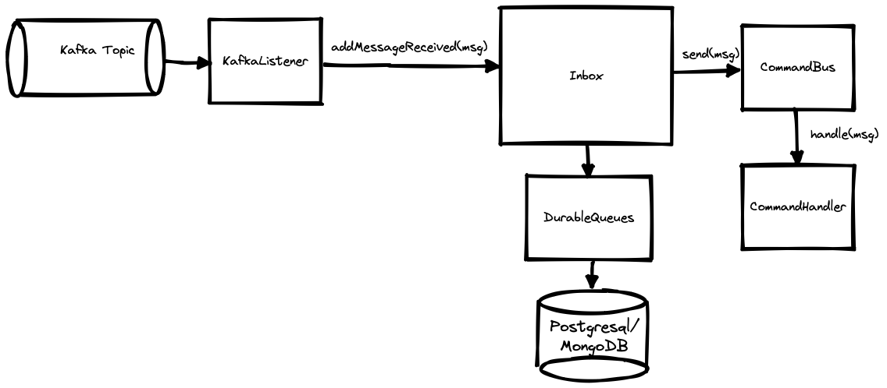
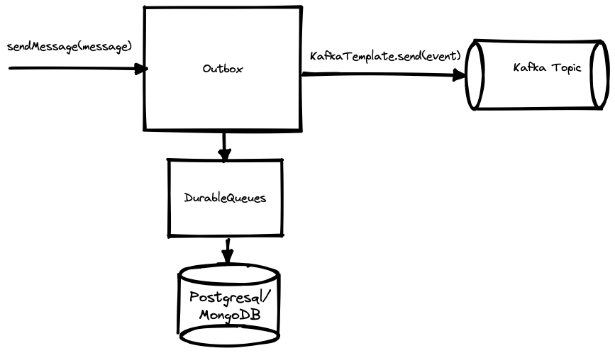

# Essentials components: MongoDB Inbox-Outbox example

The example uses the `spring-boot-starter-mongodb` that provides Spring Boot auto-configuration for all MongoDB focused Essentials components.
All `@Beans` auto-configured by this library use `@ConditionalOnMissingBean` to allow for easy overriding.

The following Essentials components are auto configured:
The `EssentialsComponentsConfiguration` auto-configures:
- Jackson/FasterXML JSON modules:
    - `EssentialTypesJacksonModule`
    - `EssentialsImmutableJacksonModule` (if `Objenesis` is on the classpath)
    - `ObjectMapper` with bean name `essentialComponentsObjectMapper` which provides good defaults for JSON serialization
- `SingleValueTypeRandomIdGenerator` to support server generated Id creations for SpringData Mongo classes with @Id fields of type `SingleValueType`
- `MongoCustomConversions` with a `SingleValueTypeConverter` covering `LockName`, `QueueEntryId` and `QueueName`
- `MongoTransactionManager` as it is needed by the `SpringMongoTransactionAwareUnitOfWorkFactory`
- `SpringMongoTransactionAwareUnitOfWorkFactory` configured to use the `MongoTransactionManager`
- `MongoFencedLockManager` using the `essentialComponentsObjectMapper` as JSON serializer
    - Supports additional properties:
    - ```
       essentials.fenced-lock-manager.fenced-locks-collection-name=fenced_locks
       essentials.fenced-lock-manager.lock-confirmation-interval=5s
       essentials.fenced-lock-manager.lock-time-out=12s
      ```
- `MongoDurableQueues` using the `essentialComponentsObjectMapper` as JSON serializer
    - Supports additional properties:
    - ```
       essentials.durable-queues.shared-queue-collection-name=durable_queues
       essentials.durable-queues.transactional-mode=fullytransactional
       essentials.durable-queues.polling-delay-interval-increment-factor=0.5
       essentials.durable-queues.max-polling-interval=2s
       # Only relevant if transactional-mode=manualacknowledgement
       # essentials.durable-queues.message-handling-timeout=5s
      ```
- `Inboxes`, `Outboxes` and `DurableLocalCommandBus` configured to use `MongoDurableQueues`
- `LocalEventBus` with bus-name `default` and Bean name `eventBus`
- `ReactiveHandlersBeanPostProcessor` (for auto-registering `EventHandler` and `CommandHandler` Beans with the `EventBus`'s and `CommandBus` beans found in the `ApplicationContext`)
- Automatically calling `Lifecycle.start()`/`Lifecycle.stop`, on any Beans implementing the `Lifecycle` interface, when the `ApplicationContext` is started/stopped

## Example Shipping flow

The `OrderShippingProcessorIT` integration-test coordinates the test flow:
- First a `ShippingOrder` aggregate is created, by sending `RegisterShippingOrder` over the `CommandBus`
  - The `OrderShippingProcessor` is auto registered with the `CommandBus` as a `CommandHandler` because it implements the `CommandHandler` interface through the `AnnotatedCommandHandler` base class
  - The `OrderShippingProcessor.handle(RegisterShippingOrder)` command handler method reacts to the `RegisterShippingOrder` in an existing Transaction/`UnitOfWork`  since the `Inbox` is configured 
  with `TransactionalMode.FullyTransactional`.
  - The `OrderShippingProcessor.handle(RegisterShippingOrder)` ensures that the `ShippingOrder` aggregate is stored 
  - And afterward it published the `ShippingOrderRegistered` event is published via the `EventBus`
- Next we simulate that the **OrderService** publishes a `OrderAccepted` event via Kafka, which the `OrderEventsKafkaListener` is listening for
- The `OrderEventsKafkaListener` reacts to the `OrderAccepted` and converts it into a `ShipOrder` command.
  - Afterwards the `ShipOrder` command is added to the `shipOrdersInbox` of type `Inbox`
  - When this is completed the handling of the `OrderAccepted` event is completed
- Asynchronously the `shipOrdersInbox` will forward the `ShipOrder` command to the `CommandBus`
  - Note: the `Order` and `ShippingOrder` are correlated/linked through the `OrderId` (aggregates reference each other using id's)
- The `OrderShippingProcessor.handle(ShipOrder)` command handler method reacts to the `ShipOrder` command
  -  
  - It loads the corresponding `ShippingOrder` instance and performs an idempotency check - if the order is already **marked-as-shipped**  
    - This idempotency check is necessary as we're using in Messaging we deal with At-Least-Once message delivery guarantee and delivery of the `ShipOrder` command can end up 
    being delivered by the `Inbox` multiple times
  - If **marking** the `ShippingOrder` as **shipped** succeeds it next publishes the `OrderShipped` event via the `EventBus`
- The `ShippingEventKafkaPublisher` is auto registered with the `EventBus` as a synchronous `EventHandler` because it implements the `EventHandler` interface through the `AnnotatedEventHandler` base class
  - Since the `ShippingEventKafkaPublisher` is a synchronous `EventHandler`, then it reacts to the `OrderShipped` event on the same thread and in the same transaction/`UnitOfWork` as the `OrderShippingProcessor.handle(ShipOrder)` method
  - The `ShippingEventKafkaPublisher.handle(OrderShipped)` method converts the `OrderShipped` event to an external event `ExternalOrderShipped`
  - The `ExternalOrderShipped` is then added to the `kafkaOutbox` of type `Outbox`, that the `ShippingEventKafkaPublisher` has configured
- Asynchronously the `kafkaOutbox` will call its Message consumer (in this case a lambda) which uses a `KafkaTemplate` to publish the `ExternalOrderShipped` to a Kafka Topic
  - 
